# CyberQuest — Pentest RPG

Un jeu de simulation de pentest où tu incarnes un hacker infiltrant le réseau de NEXUS Corp. Déplace ton personnage GHOST sur une carte top-down vue de dessus, approche-toi des machines cibles, et attaque-les depuis le terminal intégré. Récupère les 4 flags avant la fin du compte à rebours de 6 minutes.

---

## Prérequis

- **Node.js** v18+
- **npm**
- Un navigateur moderne (Chrome, Firefox, Edge)

---

## Installation & Lancement

### 1. Backend (moteur de jeu)

```bash
cd backend
npm install
node server.js
```

Le backend démarre sur **http://localhost:3001**. Tu dois voir :
```
CyberQuest backend on port 3001
```

### 2. Frontend

Dans un **deuxième terminal** :

```bash
cd frontend
npm install
npm run dev
```

Le frontend démarre sur **http://localhost:5173**

### 3. Jouer

Ouvre **http://localhost:5173** dans ton navigateur.

---

## Comment tester le projet

### Étape 1 — Sélection du personnage

Au lancement, l'écran de sélection affiche trois personnages :
- **GHOST** 🧑‍💻 — Hacktiviste (+20% XP exploit web)
- **PHANTOM** 👤 — Spécialiste réseau (+20% XP scans nmap)
- **VIPER** 🐍 — Social Engineer (+20% XP hydra & creds)

Clique sur un personnage, tape ton alias, puis clique **LANCER LA MISSION**.

### Étape 2 — Séquence d'intro

L'intro cinématique affiche le briefing mission. Clique sur **COMMENCER L'INFILTRATION** pour entrer dans le jeu.

### Étape 3 — Se déplacer sur la carte

La carte représente le réseau NEXUS Corp vu de dessus, la nuit. GHOST apparaît juste en dessous de sa base Kali Linux (en haut au centre).

| Touche | Action |
|--------|--------|
| `↑` `↓` `←` `→` | Déplacer GHOST case par case |

Quand GHOST s'approche d'une machine, une **bulle d'interaction** apparaît au-dessus de lui et ORACLE envoie un message dans le terminal.

> **Important** : les flèches déplacent exclusivement GHOST sur la carte. Toutes les autres touches (lettres, chiffres, Entrée) vont dans le terminal.

### Étape 4 — Tester la chaîne d'attaque complète

Lance le backend, ouvre le jeu, puis joue la séquence suivante dans le terminal :

#### A. Cartographier le réseau
```
nmap 192.168.1.0/24
```
Les câbles réseau s'illuminent sur la carte. ORACLE guide vers les premières cibles.

#### B. Attaquer le Web Server (FACILE)

Marche jusqu'au Web Server (bas-gauche), puis dans le terminal :
```
cd 192.168.1.10
recon
nmap -sV 192.168.1.10
nikto -h 192.168.1.10
dirb http://192.168.1.10
sqlmap -u http://192.168.1.10/login.php
cat /flag.txt
```
Flag : `CQ{w3b_s3rv3r_pwn3d}` — le bâtiment passe au vert sur la carte.

#### C. Attaquer le Mail Server (MOYEN)

Marche jusqu'au Mail Server (bas-droite) :
```
cd 192.168.1.20
recon
nmap -sV 192.168.1.20
hydra -l admin -P /usr/share/wordlists/rockyou.txt 192.168.1.20 smtp
nc 192.168.1.20 25
cat /flag.txt
```
Flag : `CQ{m41l_s3rv3r_0wn3d}` — le DB Server se déverrouille sur la carte.

#### D. Attaquer le DB Server (MOYEN)

Marche vers le centre (les couloirs de bypass autour du DB Server permettent de le contourner) :
```
cd 192.168.1.30
recon
nmap -sV 192.168.1.30
sqlmap --dump
find / -perm -u=s 2>/dev/null
sudo python3 -c "import os; os.system('/bin/bash')"
cat /flag.txt
```
Flag : `CQ{db_dump_g0t}` — le Domain Controller se déverrouille et la barrière Firewall apparaît.

#### E. Attaquer le Domain Controller (DIFFICILE — boss)

Traverse la zone Firewall (bas-centre) :
```
cd 192.168.1.100
recon
nmap -sV 192.168.1.100
searchsploit ms17-010
nc 192.168.1.100 445
whoami
sudo -l
cat /flag.txt
```
Flag : `CQ{d0m41n_4dm1n_pwn3d}` — écran de victoire avec Matrix rain.

### Étape 5 — Autres commandes utiles

| Commande | Description |
|----------|-------------|
| `hint` | Indice sur la phase actuelle |
| `help` | Liste toutes les commandes disponibles |
| `ls` | Lister les machines du réseau |
| `whoami` | Afficher ton identité et contexte |
| `exit` | Quitter la machine en cours |
| `scores` | Afficher le tableau des scores |
| `clear` / `Ctrl+L` | Effacer le terminal |
| `Ctrl+C` | Copier la sélection / annuler la commande |
| `Tab` | Autocomplétion des commandes |

### Étape 6 — Vérifier les écrans spéciaux

| Condition | Écran |
|-----------|-------|
| Timer atteint 0 (6 min écoulées) | Game Over glitch rouge |
| 4 flags récupérés | Victoire Matrix rain vert |
| ORACLE à 2 min restantes | Message d'alerte dans le terminal |
| ORACLE à 1 min restante | Message critique dans le terminal |

---

## Diagramme de séquence

Flux complet d'une session de jeu, du lancement au flag final.

```mermaid
sequenceDiagram
    actor P as Joueur
    participant UI as App.jsx (React)
    participant GM as GameMap (Canvas)
    participant T  as Terminal (xterm.js)
    participant B  as Backend (Express)
    participant CE as commandEngine.js

    P->>UI: Sélectionne personnage + alias
    UI->>UI: screen = 'intro'
    UI-->>P: IntroScreen — briefing cinématique
    P->>UI: Clique "Commencer l'infiltration"
    UI->>UI: screen = 'game' · timer 360 s démarre

    rect rgb(0, 30, 0)
        note over P,GM: Déplacement GHOST sur la carte
        loop Touche flèche pressée
            P->>GM: ↑ ↓ ← → (window keydown)
            GM->>GM: Vérifie collision NETWORK_MAP
            GM->>GM: ghostTileRef ← nouvelle position
            GM->>GM: Détection proximité machine (Manhattan ≤ 1)
            GM-->>T: ORACLE › "cd {ip}" si nouvelle machine proche
            GM-->>P: Bulle interaction au-dessus de GHOST
        end
    end

    rect rgb(0, 0, 40)
        note over P,CE: Commandes pentest dans le terminal
        loop Commande soumise
            P->>T: tape commande (ex : nmap -sV 192.168.1.10)
            T->>B: POST /api/command {command, sessionId}
            B->>CE: route vers handler
            CE->>CE: vérifie phase · met à jour gameState
            CE-->>B: {output, newState, effect, pedagogie}
            B-->>T: réponse JSON
            T-->>P: affiche output (ANSI colors)
            UI->>GM: gameState mis à jour → redessine carte
            GM-->>P: bâtiment change couleur · câble devient vert
        end
    end

    alt Timer ORACLE — 2 min restantes
        UI-->>T: ORACLE › "Accélère, ils remontent ta connexion"
    end
    alt Timer ORACLE — 1 min restante
        UI-->>T: ORACLE › "⚠ 60 secondes. Ils arrivent."
    end

    alt 4 flags capturés (gameWon = true)
        UI->>UI: screen = 'victory'
        UI-->>P: Écran Victory — Matrix rain + score final
    else Timer = 0
        UI->>UI: screen = 'gameover'
        UI-->>P: Écran Game Over — glitch rouge
    end
```



---

## Diagramme d'architecture

Relations entre les composants frontend, le backend, et les flux de données.

```mermaid
graph TB
    subgraph FE["🖥  Frontend — React + Vite  (port 5173)"]
        direction TB

        App["App.jsx\n── machine à états ──\nselect › intro › game › fin\n── refs partagées ──\nwriteToTermRef · ghostTileRef\nnearbyMachineRef · timerRef"]

        subgraph Screens["Écrans"]
            CS["CharacterSelect.jsx\nGHOST / PHANTOM / VIPER\nalias + bouton lancer"]
            IS["IntroScreen.jsx\nbriefing cinématique"]
            GO["GameOver.jsx\nglitch rouge"]
            VIC["Victory.jsx\nMatrix rain"]
        end

        subgraph Game["Jeu principal"]
            HUD["HUD.jsx\ntimer · identité\nprogression machines"]
            GM["GameMap.jsx\nCanvas 2D 960×672\ntilemap · bâtiments\nGHOST lerp · câbles\nbulle interaction"]
            TRM["Terminal.jsx\nxterm.js v5\ncommandes pentest\nautocomplétion · historique"]
            MV["MachineView.jsx\nphases pentest\nétat machine active"]
            PP["PedaPanel.jsx\nguide contextuel\nindices par phase"]
        end

        MAP["map.js\nNETWORK_MAP 20×14\nGHOST_SPAWN\nMACHINE_POSITIONS\nCABLE_LINKS"]
    end

    subgraph BE["⚙  Backend — Node.js + Express  (port 3001)"]
        direction TB
        SRV["server.js\nPOST /api/command\nGET  /api/state"]
        CE["commandEngine.js\nnmap · cd · recon · sqlmap\nhydra · cat /flag.txt\nphases · flags · ORACLE\nmessages ANSI colorés"]
        GS["gameState.js\nMap sessionId → state\npwnedMachines · phase\nxp · level · gameWon"]
    end

    App -->|"affiche selon screen"| CS & IS & GO & VIC
    App -->|"affiche"| HUD & GM & TRM & MV & PP
    GM -->|"importe"| MAP
    App -->|"importe GHOST_SPAWN\nMACHINE_POSITIONS"| MAP

    App -->|"ghostTileRef\nnearbyMachineRef"| GM
    App -->|"onWriteRef → ORACLE alerts\nonCommand → POST"| TRM
    TRM -->|"POST /api/command\n{command, sessionId}"| SRV
    SRV --> CE
    CE <-->|"lecture / écriture"| GS
    SRV -->|"{output, newState,\neffect, pedagogie}"| TRM
    TRM -->|"newState"| App
    App -->|"gameState"| GM & HUD & MV & PP

    style FE fill:#001a00,stroke:#00ff41,color:#00ff41
    style BE fill:#00001a,stroke:#0066ff,color:#88aaff
    style APP fill:#002200
    style MAP fill:#001122
```



---

## Architecture du jeu

```
cyberquest/
├── backend/
│   ├── engine/
│   │   ├── commandEngine.js   # Moteur de jeu : commandes, scénarios, flags
│   │   └── gameState.js       # Sessions en mémoire (Map par sessionId)
│   └── server.js              # API Express — POST /api/command, GET /api/state
└── frontend/
    └── src/
        ├── map.js              # Tilemap 20×14 : grille, positions machines, câbles
        ├── components/
        │   ├── CharacterSelect.jsx  # Sélection GHOST/PHANTOM/VIPER
        │   ├── IntroScreen.jsx      # Cinématique de briefing
        │   ├── GameMap.jsx          # Carte top-down Canvas (bâtiments, GHOST, câbles)
        │   ├── Terminal.jsx         # Terminal xterm.js (commandes pentest)
        │   ├── HUD.jsx              # Timer, identité, progression
        │   ├── MachineView.jsx      # Vue phases pentest par machine
        │   ├── PedaPanel.jsx        # Guide pédagogique contextuel
        │   ├── GameOver.jsx         # Écran de fin (temps écoulé)
        │   └── Victory.jsx          # Écran de victoire (Matrix rain)
        ├── sounds.js           # Sons synthétisés (Web Audio API, sans fichiers)
        ├── styles/main.css     # Animations, CRT scanlines, thème cyberpunk
        └── App.jsx             # Machine à états : select → intro → game → fin
```

---

## Technologies

| Côté | Stack |
|------|-------|
| Frontend | React 18, Vite, HTML Canvas 2D, xterm.js v5 |
| Backend | Node.js 18, Express |
| Audio | Web Audio API (aucun fichier audio) |
| État jeu | Sessions en mémoire côté backend (Map), refs côté frontend |
| Graphismes | Canvas `requestAnimationFrame` + lerp pour les animations |

---

## Auteurs

- **BouazzaZayd** — Moteur backend & logique pentest
- **isselmou** — Carte interactive & terminal
- **JamaiAli** — Interface, intégration & UX
- **Aziz Baoueb** — Co-conception initiale & Architecture standalone (branche `proof-of-concept`)
