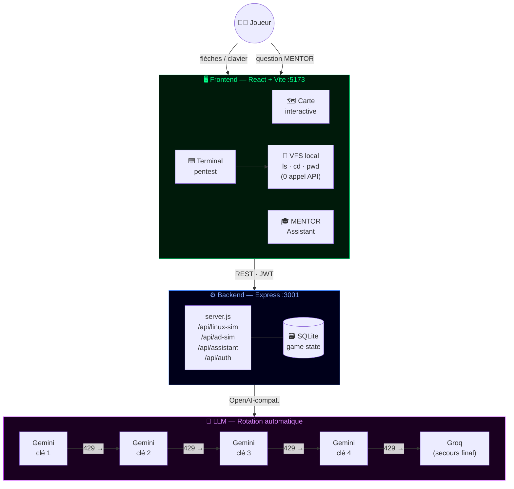
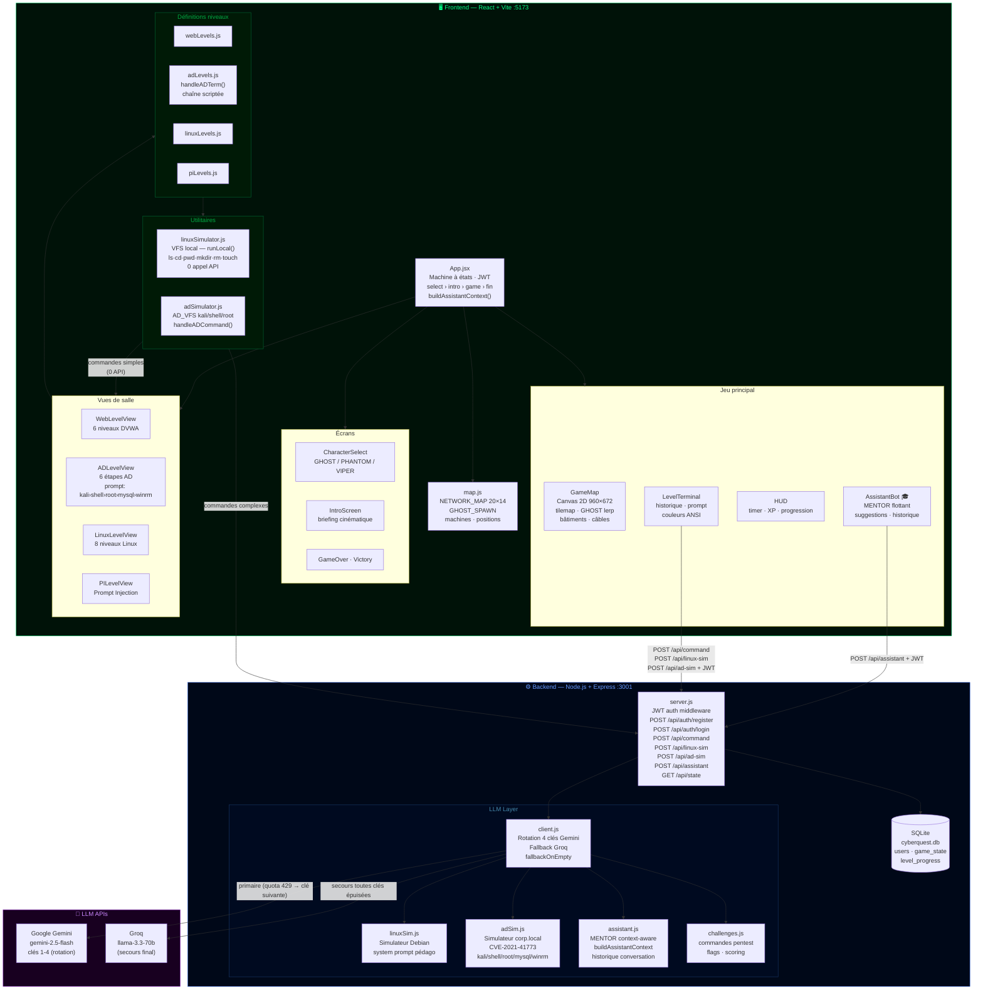

# CyberQuest — Pentest RPG

> Plateforme d'apprentissage de la cybersécurité sous forme de jeu RPG. Incarne GHOST, un hacker infiltrant le réseau de NEXUS Corp. Déplace ton personnage sur une carte top-down, attaque les machines depuis un terminal intégré, et progresse à travers 5 salles spécialisées guidées par une IA.

---

## Rooms disponibles

| Room | Thème | Niveaux |
|------|-------|---------|
| 🌐 **Web Application** | DVWA, Docker, SQLi, XSS, CSRF, LFI | 6 |
| 🪟 **Active Directory** | nmap → CVE-2021-41773 → PrivEsc → Pass-the-Hash | 6 |
| 🐧 **Linux Training** | Navigation, permissions, réseau, shell avancé | 8 |
| 🧠 **Prompt Injection** | Sécurité LLM, jailbreak, défenses IA | 4 |
| 🤖 **AI Core** | Architecture IA, biais, adversarial ML | 4 |

---

## Prérequis

- **Node.js** v18+
- **npm**
- Un navigateur moderne (Chrome, Firefox, Edge)
- Clés API : Google Gemini (aistudio.google.com) et/ou Groq (console.groq.com)

---

## Installation & Lancement

### 1. Backend

```bash
cd backend
npm install
```

Crée le fichier `backend/.env` :

```env
LLM_PROVIDER=gemini

GEMINI_API_KEY=ta_cle_1
GEMINI_API_KEY_2=ta_cle_2
GEMINI_API_KEY_3=ta_cle_3
GEMINI_API_KEY_4=ta_cle_4
GEMINI_MODEL=gemini-2.5-flash

GROQ_API_KEY=gsk_...
GROQ_MODEL=llama-3.3-70b-versatile
```

```bash
node server.js
# → CyberQuest backend on port 3001
```

### 2. Frontend

```bash
cd frontend
npm install
npm run dev
# → http://localhost:5173
```

---

## Architecture simplifiée

Vue d'ensemble en 3 couches — joueur, application, IA.



---

## Architecture détaillée

Tous les composants, routes et flux de données.



---

## Diagramme de séquence

Flux complet : authentification → exploration → commande → réponse LLM → validation niveau.

```mermaid
sequenceDiagram
    actor P as 🧑‍💻 Joueur
    participant FE  as Frontend (React)
    participant VFS as VFS Local
    participant BE  as Backend (Express)
    participant DB  as SQLite
    participant LLM as LLM Client

    note over LLM: Gemini clé1→2→3→4 → Groq

    P->>FE: Register / Login
    FE->>BE: POST /api/auth/login
    BE->>DB: vérif hash bcrypt
    DB-->>BE: user row
    BE-->>FE: JWT token (24h)
    FE-->>P: Écran sélection personnage

    P->>FE: Choisit personnage + alias
    FE-->>P: Cinématique intro
    P->>FE: "Commencer l'infiltration"
    FE-->>P: Carte NEXUS Corp + terminal

    rect rgb(0, 30, 10)
        note over P,FE: Déplacement sur la carte
        P->>FE: Touches ↑↓←→
        FE->>FE: Collision check NETWORK_MAP
        FE-->>P: GHOST se déplace, bulle interaction
        P->>FE: Approche machine → Entre dans la room
    end

    rect rgb(0, 10, 40)
        note over P,LLM: Commande dans le terminal
        P->>FE: tape "ls" (commande simple)
        FE->>VFS: runLocal("ls", envState)
        VFS-->>FE: output instantané (0 appel API)
        FE-->>P: Documents  Downloads  config.php

        P->>FE: tape "nmap 192.168.1.0/24"
        FE->>BE: POST /api/ad-sim {cmd, levelN, prompt} + JWT
        BE->>BE: vérifie JWT
        BE->>LLM: chat({messages, fallbackOnEmpty:true})

        alt Gemini clé 1 disponible
            LLM->>LLM: callOnce(GEMINI_URL, key1, ...)
            LLM-->>BE: {ok:true, content, provider:"gemini"}
        else Quota 429 clé 1
            LLM->>LLM: callOnce(GEMINI_URL, key2, ...)
            LLM-->>BE: {ok:true, content, keyIndex:1}
        else Toutes clés Gemini épuisées
            LLM->>LLM: callGroq(opts)
            LLM-->>BE: {ok:true, content, provider:"groq"}
        end

        BE-->>FE: {output: [...lines]}
        FE-->>P: sortie terminal colorée
    end

    rect rgb(30, 0, 0)
        note over P,LLM: Question MENTOR
        P->>FE: clique 🎓 → pose une question
        FE->>BE: POST /api/assistant {question, context, history} + JWT
        BE->>LLM: askAssistant(question, context)
        LLM-->>BE: réponse pédagogique
        BE-->>FE: {answer}
        FE-->>P: bulle MENTOR avec explication
    end

    alt Objectif de niveau validé
        FE->>BE: PATCH /api/state {levelN, done:true} + JWT
        BE->>DB: upsert level_progress
        DB-->>BE: ok
        BE-->>FE: {xpGained, newLevel}
        FE-->>P: Toast "Niveau validé ✅" + bouton Suivant
    end
```



---

## Structure du projet

```
CyberquestProject/
├── backend/
│   ├── llm/
│   │   ├── client.js          # Client LLM unifié — rotation 4 clés Gemini + Groq fallback
│   │   ├── linuxSim.js        # Simulateur terminal Linux pédagogique
│   │   ├── adSim.js           # Simulateur pentest AD (corp.local, CVE-2021-41773)
│   │   ├── assistant.js       # MENTOR — réponses contextuelles room/niveau
│   │   └── challenges.js      # Commandes pentest, flags, scoring
│   ├── server.js              # API Express + JWT auth middleware
│   ├── .env                   # Clés API (gitignored — ne jamais commit)
│   └── cyberquest.db          # SQLite (gitignored)
└── frontend/src/
    ├── App.jsx                # Machine à états principale + buildAssistantContext()
    ├── map.js                 # Tilemap 20×14, positions machines
    ├── components/
    │   ├── GameMap.jsx            # Carte Canvas top-down
    │   ├── LevelTerminal.jsx      # Terminal partagé toutes rooms
    │   ├── AssistantBot.jsx       # Widget MENTOR flottant 🎓
    │   ├── ADLevelView.jsx        # Room Active Directory
    │   ├── LinuxLevelView.jsx     # Room Linux
    │   ├── LinuxLevelMap.jsx      # Sélecteur 8 niveaux Linux
    │   └── ...                    # Web, PI, AI Core views
    ├── levels/
    │   ├── adLevels.js            # Chaîne d'attaque AD scriptée (6 étapes)
    │   ├── linuxLevels.js         # 8 niveaux Linux
    │   ├── webLevels.js           # 6 niveaux DVWA
    │   └── piLevels.js            # Niveaux Prompt Injection
    └── utils/
        ├── linuxSimulator.js      # Moteur VFS local (ls/cd/pwd/mkdir/rm… sans API)
        └── adSimulator.js         # AD_VFS kali/shell/root + fallback LLM
```

---

## Technologies

| Couche | Stack |
|--------|-------|
| Frontend | React 18, Vite 5, HTML Canvas 2D |
| Backend | Node.js 18, Express, better-sqlite3 |
| Auth | JWT (jsonwebtoken), bcrypt |
| LLM | Google Gemini 2.5 Flash (×4 clés) + Groq llama-3.3-70b (fallback) |
| VFS | Moteur JavaScript local — 0 appel API pour ls/cd/pwd/mkdir/rm |
| État jeu | SQLite côté backend, useState/envState côté frontend |

---

## Gestion des quotas LLM

```
Commande reçue
    │
    ├─ ls / cd / pwd / mkdir / rm / touch → VFS local (instantané, 0 API)
    │
    └─ Commande complexe (nmap, cat, crackmapexec…)
            │
            ├─ Gemini clé 1  ──429──▶  Gemini clé 2  ──429──▶  Gemini clé 3  ──429──▶  Gemini clé 4
            │                                                                                  │
            └──────────────────────────────── 429 ────────────────────────────────────▶  Groq (fallback)
```

Chaque clé Gemini offre **10 req/min · 500 req/jour** → capacité totale : **40 req/min · 2 000 req/jour**.

---

## Chaîne d'attaque Active Directory

```
Kali (10.0.0.1)
    │
    ├─ 1. nmap 192.168.1.0/24          → découverte hôtes actifs
    ├─ 2. dnsrecon / nikto             → énumération AD, CVE-2021-41773 confirmé
    ├─ 3. CVE-2021-41773 RCE           → shell www-data@192.168.1.10
    ├─ 4. sudo python3 privesc         → root + /var/www/html/config.php (db_user:Str0ngP@ss)
    ├─ 5. mysql -h 192.168.1.30        → dump table credentials → hash NTLM Administrator
    └─ 6. evil-winrm Pass-the-Hash     → DC (192.168.1.100) → NTDS.dit → Golden Ticket
```

---

## Auteurs

- **BouazzaZayd** — Moteur backend & logique pentest
- **isselmou** — Carte interactive & terminal
- **JamaiAli** — Interface, intégration, LLM & UX
- **Aziz Baoueb** — Co-conception initiale & Architecture standalone (`proof-of-concept`)
